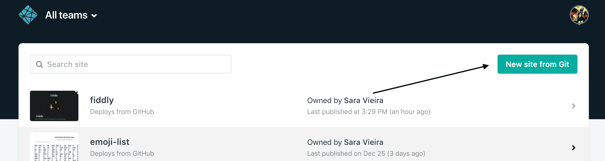
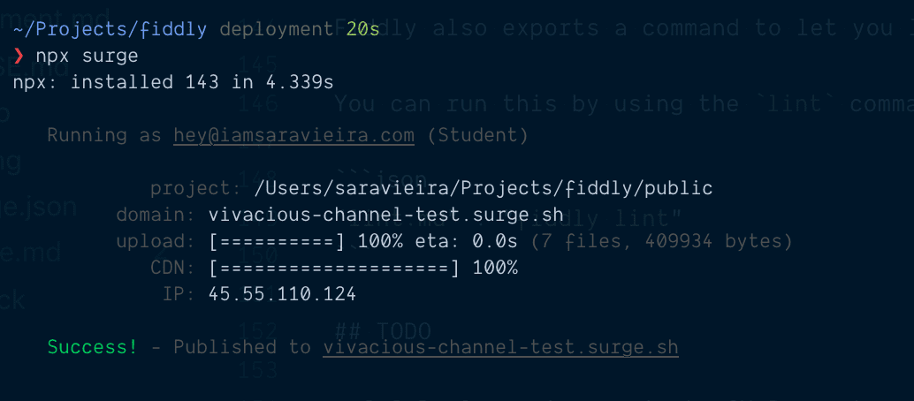

# Deployment

<br/>

- [Netlify](#netlify)
- [Vercel](#vercel)
- [Surge](#surge)
- [GitHub Pages](#githubpages)
- [GitLab Pages](#gitlabpages)

## Netlify

Head over to [Netlify](https://netlify.com) and click on new site from git:



It will ask you to choose a provider and choose the one you are using. After that it will ask you for what repo it is and after you selected it just select these options on the next screen:

- Build command: `npx oranda`
- Publish directory: `public`

_The public folder may be a different one depending on the dist folder you selected_

## Vercel

Vercel is very similar to Netlify, choose your repo and then add `npx oranda` as the build command. If you changed the dist folder select the current one otherwise it defaults to public.

## Surge

To deploy with Surge you need a [Surge](http://surge.sh) account and then to install the surge cli or like me run with npx.
It will ask you to login and after that it wants to know the project path. In here you put the dist folder.
After that pick and domain and done 🎉



## GitHub Pages

For GitHub pages there is a command:

```bash
oranda deploy
```

This command will build your project if no version exists and deploy it to `gh-pages` branch on github.
It uses [gh-pages](https://github.com/tschaub/gh-pages#options) under the hood so any options you pass there you can also pass in your `deployment` option in your config.
✨

## Gitlab Pages

To deploy to Gitlab Pages add a new job with the title _pages_ in your `.gitlab-ci.yml` configuration file.
Gitlab Pages hosts your static files at `https://<group-or-user-name>.gitlab.io/<project-name>`.
You can use the `PATH_PREFIX` environment variable to configure your oranda build.
🎉

```yaml
pages:
  image: node
  script:
    - PATH_PREFIX="/$CI_PROJECT_NAME" npx oranda
  artifacts:
    paths:
      - public
  only:
    - main
```
